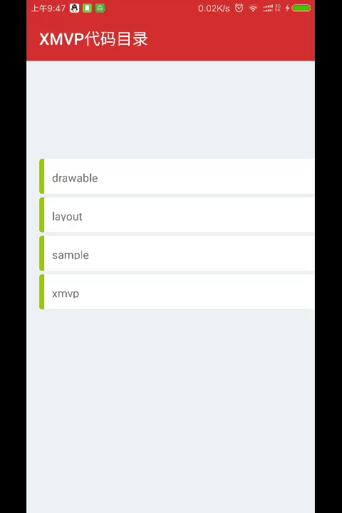

# XMVP
Extract the MVP from the project
# Display code 

# How to use?
### step1:define a contract
You need to define a contract in contracts package, it contains a extend 'Contract.BasePresenter' interface and a extend 'Contract.BaseView' interface.
> example:MainContract

``` java
public interface MainContract {
    interface Presenter extends Contract.BasePresenter{
        void requestTextData();
    }
    interface View extends Contract.BaseView{
        void showText(String text);
    }
}
```

### step2:need modle deal data
> example:I create 'DataFill.java' file in model packege

``` java
public class DataFill {
    public static String getText() {
        return "...." ;
    }
}
```

### step3:add a Presenter
> example: MainPresenter.java

``` java
public class MainPresenter extends BasePresenter<MainContract.View> implements MainContract.Presenter {

    public MainPresenter(MainContract.View view) {
        super(view);
    }

    @Override
    public void start() {
        super.start();
        requestTextData();
    }

    @Override
    public void requestTextData() {
        String textData = DataFill.getText();
        view.showText(textData);
    }
}
```

### step4:add a View
> example: MainActivity.java

``` java
public class MainActivity extends BaseActivity<MainPresenter> implements MainContract.View {
    @BindView(R.id.tvText)
    TextView tvText;

    @Override
    protected int getContentId() {
        return R.layout.activity_main2;
    }


    @Override
    public void showText(String text) {
        tvText.setText(text);
    }
}
```


# License
```
   Copyright 2016 XuJiaji

   Licensed under the Apache License, Version 2.0 (the "License");
   you may not use this file except in compliance with the License.
   You may obtain a copy of the License at

       http://www.apache.org/licenses/LICENSE-2.0

   Unless required by applicable law or agreed to in writing, software
   distributed under the License is distributed on an "AS IS" BASIS,
   WITHOUT WARRANTIES OR CONDITIONS OF ANY KIND, either express or implied.
   See the License for the specific language governing permissions and
   limitations under the License.
```
